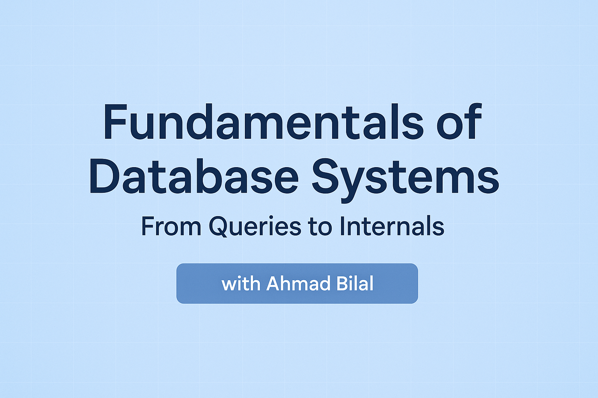

# 🗂️ Fundamentals of Database Systems: From Queries to Internals

Welcome to your journey through the world of database systems! Use this index to navigate the course, jump to any chapter, or revisit topics as needed.

---

## 👨‍💻 Meet Your Instructor

Hello! I'm **Ahmad Bilal**, a Senior Full Stack Engineer with over 5 years of hands-on experience. I specialize in architecting and deploying secure, scalable backend systems and cloud infrastructure, with a strong focus on DevOps practices. My passion is helping engineers bridge the gap between theory and real-world application—so you can build systems that are robust, efficient, and ready for scale.

I'm excited to guide you through this course and share the insights, lessons, and best practices I've learned in the field. Let's level up your database engineering skills together!

---

## 📖 How to Use This Course
- Start from the beginning for a structured learning path, or jump to topics that interest you.
- Each chapter ends with a quiz and navigation links.
- Return here anytime to find your next lesson!

---

## 📚 Course Chapters

1. [🎉 Introduction & Welcome](01-introduction-and-welcome.md)  
   *Course overview, prerequisites, and how to get the most from this journey.*
2. [💎 ACID Properties in Database Systems](02-acid-properties.md)  
   *The foundation of reliable transactions: Atomicity, Consistency, Isolation, Durability.*
3. [🏗️ Database Internals](03-database-internals.md)  
   *How tables, pages, and indexes are stored on disk.*
4. [🏷️ Indexing](04-database-indexing.md)  
   *Types of indexes, how they work, and best practices for query optimization.*
5. [🌳 B-Trees & B+Trees](05-b-trees-and-bplus-trees.md)  
   *The data structures powering fast lookups and range queries.*
6. [🧩 Partitioning](06-database-partitioning.md)  
   *Splitting large tables for performance and manageability.*
7. [🪓 Sharding](07-database-sharding.md)  
   *Scaling databases horizontally across servers.*
8. [🔄 Concurrency Control](08-concurrency-control.md)  
   *Locks, isolation levels, and how databases handle simultaneous transactions.*
9. [🔁 Replication](09-database-replication.md)  
   *Keeping data consistent and available across multiple instances.*
10. [🏗️ System Design](10-database-system-design.md)  
    *Real-world database architectures and design patterns.*
11. [⚙️ Database Engines](11-database-engines.md)  
    *Comparing MySQL, PostgreSQL, and storage engines.*
12. [🧭 Cursors](12-database-cursors.md)  
    *Row-by-row processing and when to use cursors.*
13. [🔒 Security](13-database-security.md)  
    *Authentication, authorization, encryption, and securing APIs.*
14. [🧬 Homomorphic Encryption](14-homomorphic-encryption.md)  
    *Querying encrypted data and privacy-preserving techniques.*
15. [❓ Q&A](15-database-qa.md)  
    *Answers to common questions and deeper dives into tricky topics.*
16. [💬 Discussions](16-database-discussions.md)  
    *Community-driven insights, query optimization, and storage debates.*
17. [🧩 Database Fundamentals & Recovery](17-database-fundamentals-and-recovery.md)  
    *Key lessons and advanced concepts from core database topics.*
18. [🎓 Course Closing & Further Reading](18-course-closing-and-further-reading.md)  
    *Final thoughts, real-world tips, and resources for continued learning.*

---

## 🏁 Ready to Begin?
Start with the [Introduction & Welcome](01-introduction-and-welcome.md) or pick any chapter from above!

---

Happy learning! 🚀 